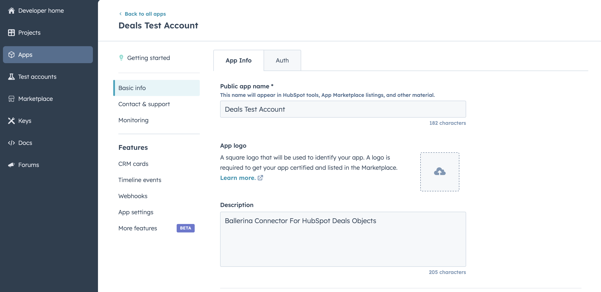
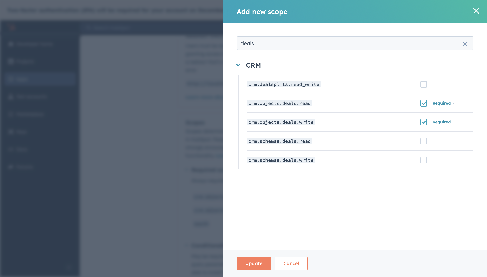

# Ballerina Ballerina HubSpot CRM Deals Connector connector

[](https://github.com/ballerina-platform/module-ballerinax-hubspot.crm.object.deals/actions/workflows/ci.yml)
[](https://github.com/ballerina-platform/module-ballerinax-hubspot.crm.object.deals/actions/workflows/trivy-scan.yml)
[](https://github.com/ballerina-platform/module-ballerinax-hubspot.crm.object.deals/actions/workflows/build-with-bal-test-graalvm.yml)
[](https://github.com/ballerina-platform/module-ballerinax-hubspot.crm.object.deals/commits/master)
[](https://github.com/ballerina-platform/ballerina-library/labels/module%hubspot.crm.object.deals)

## Overview

[HubSpot](https://developers.hubspot.com/docs/reference/api) is is an AI-powered customer platform.

The `ballerinax/hubspot.crm.object.deals` package offers APIs to connect and interact with [HubSpot API](https://developers.hubspot.com/docs/reference/api) endpoints, specifically based on [HubSpot API v3](https://developers.hubspot.com/docs/reference/api).


## Setup guide

To use the HubSpot Marketing Events connector, you must have access to the HubSpot API through a HubSpot developer account and a HubSpot App under it. Therefore you need to register for a developer account at HubSpot if you don't have one already.

### Step 1: Create/Login to a HubSpot Developer Account

If you have an account already, go to the [HubSpot developer portal](https://app.hubspot.com/)

If you don't have a HubSpot Developer Account you can sign up to a free account [here](https://developers.hubspot.com/get-started)

### Step 2 (Optional): Create a [Developer Test Account](https://developers.hubspot.com/beta-docs/getting-started/account-types#developer-test-accounts) under your account

Within app developer accounts, you can create developer test accounts to test apps and integrations without affecting any real HubSpot data.

**_These accounts are only for development and testing purposes. In production you should not use Developer Test Accounts._**

1. Go to Test Account section from the left sidebar.

    

2. Click Create developer test account.

   

3. In the dialogue box, give a name to your test account and click create.

   

### Step 3: Create a HubSpot App under your account.

1. In your developer account, navigate to the "Apps" section. Click on "Create App"
   

2. Provide the necessary details, including the app name and description.

### Step 4: Configure the Authentication Flow.

1. Move to the Auth Tab.


   

2. In the Scopes section, add the following scopes for your app using the "Add new scope" button.

   `crm.objects.deals.read`
   `crm.objects.deals.write`

   

4. Add your Redirect URI in the relevant section. You can also use localhost addresses for local development purposes. Click Create App.

   

### Step 5: Get your Client ID and Client Secret

- Navigate to the Auth section of your app. Make sure to save the provided Client ID and Client Secret.

   

### Step 6: Setup Authentication Flow

Before proceeding with the Quickstart, ensure you have obtained the Access Token using the following steps:

1. Create an authorization URL using the following format:

   ```
   https://app.hubspot.com/oauth/authorize?client_id=<YOUR_CLIENT_ID>&scope=<YOUR_SCOPES>&redirect_uri=<YOUR_REDIRECT_URI>
   ```

   Replace the `<YOUR_CLIENT_ID>`, `<YOUR_REDIRECT_URI>` and `<YOUR_SCOPES>` with your specific value.

2. Run the Following Ballerina Code Snippet to start the local server which will accept your Oath callbacks;

   ```ballerina
   import ballerina/http;
   import ballerina/io;
   
   //edit this before running
   string clientId = "<Client ID>";
   string clientSecret = "<Client Secret>";

   public function getRefresh(string cd) returns json|error {

      http:Client hubendpoint = check  new("https://api.hubapi.com");
      string payload = string `grant_type=authorization_code&client_id=${ClientId}&client_secret={clientSecret}&redirect_uri=http://localhost:9090&code=${cd}`;

      // Send the token request
      json|error response = hubendpoint->post("/oauth/v1/token", payload, {
         "Content-Type": "application/x-www-form-urlencoded"
      });

      return response;

   };

   service / on new http:Listener(9090) {
    resource function get .(http:Caller caller, http:Request req) returns error? {
        // Extract the "code" query parameter from the URL
        string? code = req.getQueryParamValue("code");

        if code is string {
            // Log the received code
            io:println("Authorization code received: " + code);
            // Respond to the client with the received code
            check caller->respond("Received code: " + code);
            json|error res = getRefresh(code);
            io:println(res);
        } else {
            // Respond with an error message if no code is found
            check caller->respond("Authorization code not found.");
        }
    }
   };
   ```

3. Paste it in the browser and select your developer test account to intall the app when prompted.
    
   

4. After the installation, you will be redirected to the localhost server you started in the previous step. The server will print the authorization code in the console.

   ```json
   {
     "token_type": "bearer",
     "refresh_token": "<Refresh Token>",
     "access_token": "<Access Token>",
     "expires_in": 1800
   }
   ```

5. Store the `refresh_token` securely for use in your application

## Quickstart

To use the `HubSpot Deals` connector in your Ballerina application, update the `.bal` file as follows:

### Step 1: Import the module

Import the `hubspot.crm.obj.deals` module.

```
import ballerinax/hubspot.crm.obj.deals;
```

### Step 2: Instantiate a new connector

1. Create a `deals:ConnectionConfig` with the obtained access token and initialize the connector with it.

   ```ballerina
   configurable string clientId = ?;
   configurable string clientSecret = ?;
   configurable string refreshToken = ?;
   
   deals:OAuth2RefreshTokenGrantConfig auth = {
        clientId,
        clientSecret,
        refreshToken,
        credentialBearer: oauth2:POST_BODY_BEARER
    };
   final deals:Client hubSpotDeals = check new ({ auth });
   ```

2. Create a `config.toml` file and, configure the obtained credentials in the above steps as follows:
   ```toml
   clientId = "<Client ID>"
   clientSecret = "<Client Secret>"
   refreshToken = "<Access Token>"
   ```

### Step 3: Use Connector Operations

Utilize the connector's operations to create, update and delete deals etc.
#### Create a Deal
```ballerina
   deals:SimplePublicObjectInputForCreate payload = {
        properties: {
            "pipeline": "default",
            "dealname": "Test Deal",
            "amount": "100000"
        }
    };

    SimplePublicObject out = check hubspot->/.post(payload = payload);
```
#### List Deals
```ballerina
   deals:CollectionResponseSimplePublicObjectWithAssociationsForwardPaging deals = check  hubspot->/;
```

## Examples

The `ballerinax/hubspot.crm.obj.deals` connector provides practical examples illustrating usage in various scenarios.Explore these [examples](/examples), covering the following use cases:

1. [Manage Deals](/examples/sales-pipeline) - see how the Hubspot API can be used to create deal and manage it through the sales pipeline.
2. [Count Deals](/examples/count-deals) - see how the Hubspot API can be used to count the number of deals in each stages of sales pipeline.


## Build from the source

### Setting up the prerequisites

1. Download and install Java SE Development Kit (JDK) version 21. You can download it from either of the following sources:

    * [Oracle JDK](https://www.oracle.com/java/technologies/downloads/)
    * [OpenJDK](https://adoptium.net/)

   > **Note:** After installation, remember to set the `JAVA_HOME` environment variable to the directory where JDK was installed.

2. Download and install [Ballerina Swan Lake](https://ballerina.io/).

3. Download and install [Docker](https://www.docker.com/get-started).

   > **Note**: Ensure that the Docker daemon is running before executing any tests.

4. Export Github Personal access token with read package permissions as follows,

    ```bash
    export packageUser=<Username>
    export packagePAT=<Personal access token>
    ```

### Build options

Execute the commands below to build from the source.

1. To build the package:

   ```bash
   ./gradlew clean build
   ```

2. To run the tests:

   ```bash
   ./gradlew clean test
   ```

3. To build the without the tests:

   ```bash
   ./gradlew clean build -x test
   ```

4. To run tests against different environments:

   ```bash
   ./gradlew clean test -Pgroups=<Comma separated groups/test cases>
   ```

5. To debug the package with a remote debugger:

   ```bash
   ./gradlew clean build -Pdebug=<port>
   ```

6. To debug with the Ballerina language:

   ```bash
   ./gradlew clean build -PbalJavaDebug=<port>
   ```

7. Publish the generated artifacts to the local Ballerina Central repository:

    ```bash
    ./gradlew clean build -PpublishToLocalCentral=true
    ```

8. Publish the generated artifacts to the Ballerina Central repository:

   ```bash
   ./gradlew clean build -PpublishToCentral=true
   ```

## Contribute to Ballerina

As an open-source project, Ballerina welcomes contributions from the community.

For more information, go to the [contribution guidelines](https://github.com/ballerina-platform/ballerina-lang/blob/master/CONTRIBUTING.md).

## Code of conduct

All the contributors are encouraged to read the [Ballerina Code of Conduct](https://ballerina.io/code-of-conduct).

## Useful links

* For more information go to the [`hubspot.crm.object.deals` package](https://central.ballerina.io/ballerinax/hubspot.crm.object.deals/latest).
* For example demonstrations of the usage, go to [Ballerina By Examples](https://ballerina.io/learn/by-example/).
* Chat live with us via our [Discord server](https://discord.gg/ballerinalang).
* Post all technical questions on Stack Overflow with the [#ballerina](https://stackoverflow.com/questions/tagged/ballerina) tag.
